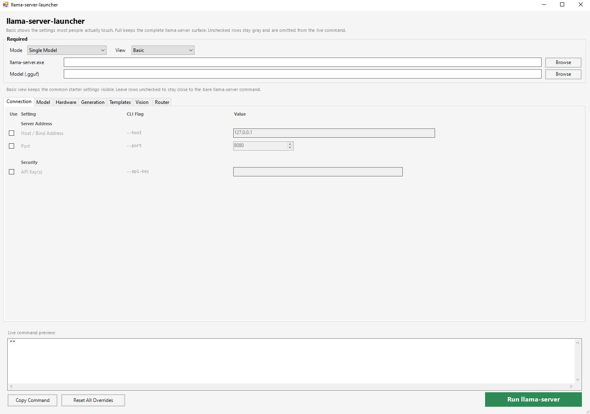

# llama-server-launcher
Lightweight Windows `.bat` launcher with a PowerShell/WinForms GUI for configuring and launching [llama-server](https://github.com/ggml-org/llama.cpp/tree/master/tools/server) from llama.cpp.

## What's new on v2.0
- Performance improvements
- Better functionality
- Save command file for easy launching

## How to use
1. Download `llama-server-launcher.bat`.
2. Optionally place it in the same folder as `llama-server.exe` for auto-detection.
3. Double-click the `.bat` file.
4. Browse to your `llama-server.exe` and pick a `.gguf` model (or use a Hugging Face repo).
5. Check any options you want to override - unchecked rows are omitted from the command.
6. Click **Run llama-server** or **Copy Command**. No install, no dependencies beyond Windows and PowerShell.

## Features

- **Single file** - one `.bat` that embeds a PowerShell/WinForms GUI. Nothing to install.
- **Simple two-tab workflow** - *Quick Setup* shows the settings most people touch; *All Options* exposes the complete llama-server CLI surface.
- **Live command preview** - see the exact command line update in real time as you change options.
- **Copy or Run** - copy the built command to your clipboard, or launch llama-server directly from the GUI.
- **Auto-detection** - if the launcher sits next to `llama-server.exe`, the path fills in automatically.
- **Tooltips** - hover over the options to read tooltips explaining what it does and when to use it.
- **Searchable option index** - the *All Options* tab lets you search across every flag and jump to it.

## How it works
The `.bat` bootstrap reads the embedded PowerShell script from itself and runs it in memory. The PowerShell script builds the WinForms GUI entirely in memory - no install and no extra files are created, except an error log in `%TEMP%` if startup fails.

## Warning
Do not type private tokens into the GUI unless you trust your local clipboard/screen environment.

## License
MIT
